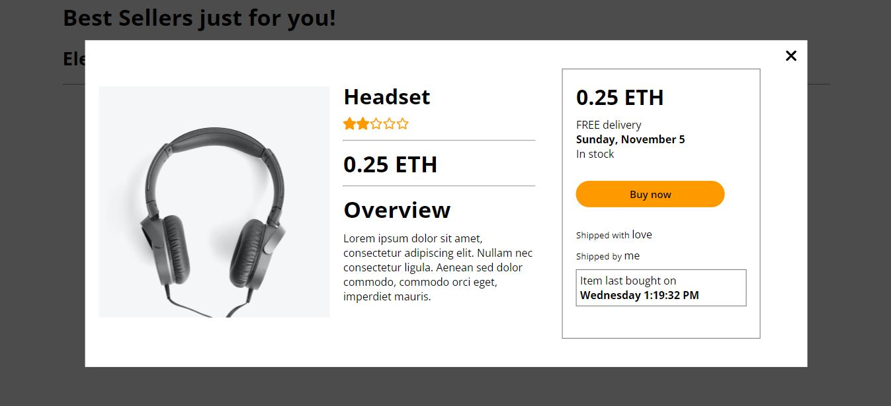

# Amazon Clone
A decentralized e-commerce platform built on blockchain technology.

## Features

- **Decentralized Marketplace:** A blockchain-based e-commerce platform for buying and selling products.

- **Product Categories:** Products are organized into three categories: Electronics, Clothing, and Toys.

- **ETH Payment:** Users can purchase items using Ethereum (ETH) cryptocurrency.

- **Order History:** Users can view their latest orders for each product.

## Technology Stack & Tools

- Solidity (Writing Smart Contracts & Tests)
- Javascript (React & Testing)
- [Hardhat](https://hardhat.org/) (Development Framework)
- [Ethers.js](https://docs.ethers.io/v5/) (Blockchain Interaction)
- [React.js](https://reactjs.org/) (Frontend Framework)

## Requirements For Initial Setup
- Install [NodeJS](https://nodejs.org/en/)

## Setting Up
### 1. Clone/Download the Repository

### 2. Install Dependencies:
`$ npm install`

### 3. Run tests
`$ npx hardhat test`

### 4. Start Hardhat node
`$ npx hardhat node`

### 5. Run deployment script
In a separate terminal execute:
`$ npx hardhat run ./scripts/deploy.js --network localhost`

### 6. Set configuration
Copy Dapp(smart contract) deployment address and make changes in `src/config.example.json`  
Rename `config.example.json` to `config.json`

### 7. Start frontend
`$ npm run start`

## Visuals
### WebApp

    

### Product Page

    

### Demo

    

